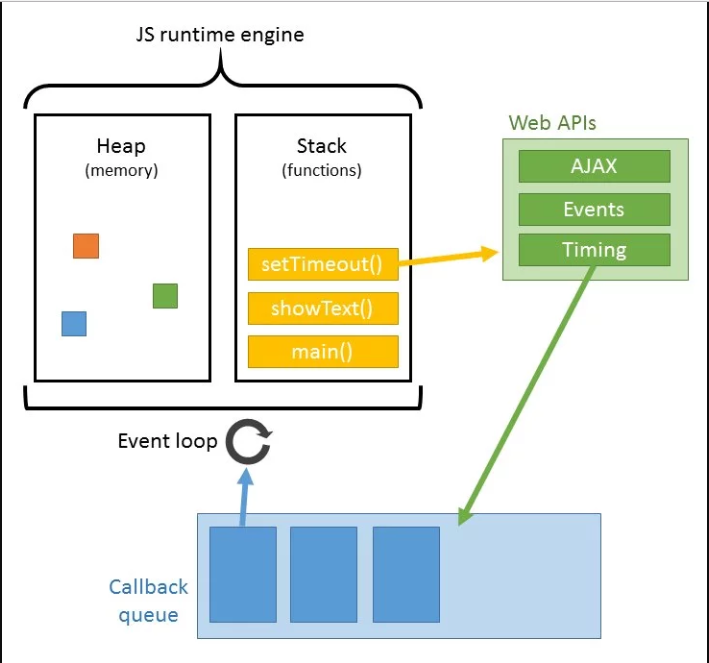
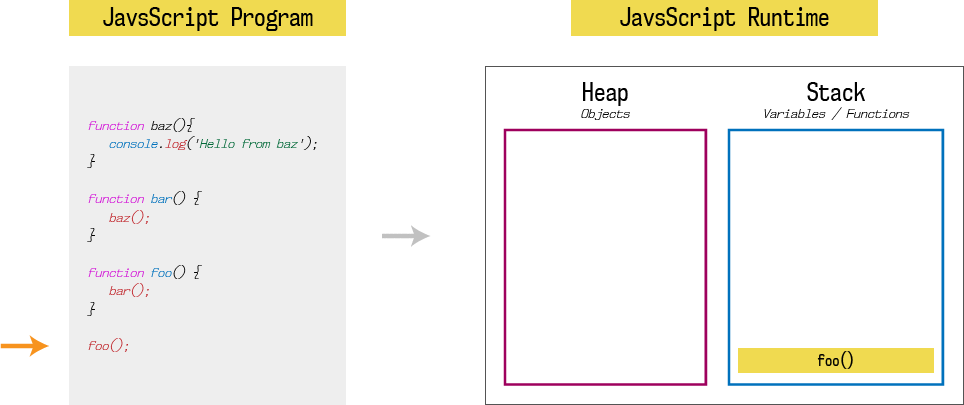
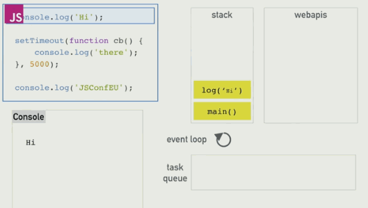

# Event Loop
---
### Menu
- What is event loop ?
- Why should we know ?
---
### What is event loop ?
Event loop is what allow js application to work with asynchronous operations.

Browser under the hood has:
+ Call stack.
+ Event loop & event (or callback) queue.
+ Js Heap.
+ Web APIs.
---

---

---
How about async operations, how does it work ?
When call stack has function that use web apis with callback, it will register callback to the api. Then the api will send callback to callback queue if something happens. Event loop will check if the call stack is empty, it will pick the callback from call back queue and push to call stack.
---

---
[Example](http://latentflip.com/loupe/?code=ZnVuY3Rpb24gcHJpbnRIZWxsbygpIHsNCiAgICBjb25zb2xlLmxvZygnSGVsbG8gZnJvbSBiYXonKTsNCn0NCg0KZnVuY3Rpb24gYmF6KCkgew0KICAgIHNldFRpbWVvdXQocHJpbnRIZWxsbywgMTAwMCk7DQogICAgY29uc29sZS5sb2coJ2RvbmUnKTsNCn0NCg0KZnVuY3Rpb24gZm9vKCkgew0KICAgIGJheigpOw0KfQ0KDQpmb28oKTs%3D!!!PGJ1dHRvbj5DbGljayBtZSE8L2J1dHRvbj4%3D)
---
### Why should we know it ?

Ok, it's great, but why should we know it ? I can code the app without knowing too much about it.

-> For our app which needs real time data and has a lot of user's interactions, knowing event-loop will help us understand and avoid the regular bugs in React app:
```
Warning: setState(…): Can only update a mounted or mounting component. This usually means you called setState() on an unmounted component.
```
or the wrong real time data being setState in component like OrderBook component.
---
```
class OrderBook extends Component {
  componentDidMount() {
    this.subscribe();
  }
  subscribe() {
    if (this.unsubscribe) {
      this.unsubscribe();
    }
    getOrderBook(this.props.productId)
      .then((data) => {
        this.setState({
          orderBookData: data,
        });
        subscribe(this.props.productId, this.onSubscribe)
          .then((unsubscribe) => {
            this.unsubscribe = unsubscribe;
          });
      });
  }
  onSubscribe(data) {
    this.setState({
      orderBookData: data,
    });
  }
  componentWillReceiveProps(nextProps) {
    if (nextProps.productId !== this.props.productId) {
      this.subscribe();
    }
  }
  componentWillUnmount() {
    if (this.unsubscribe) {
      this.unsubscribe();
    }
  }
}
```
---
### Solution
https://reactjs.org/blog/2015/12/16/ismounted-antipattern.html
---
### References
+ https://www.youtube.com/watch?v=8aGhZQkoFbQ
+ https://itnext.io/how-javascript-works-in-browser-and-node-ab7d0d09ac2f