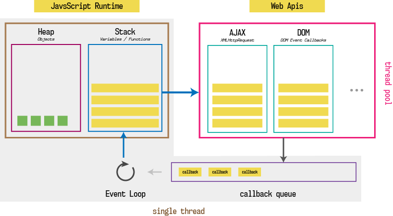

# Event Loop
---
### Menu
- What is event loop ?
- Why should we know ?
---
### What is event loop ?
Event loop is what allow js application to work with asynchronous operations. It has:
+ Call stack.
+ Event loop & event queue.
+ Js Heap.
+ Web API.
---

---
### Call stack.
